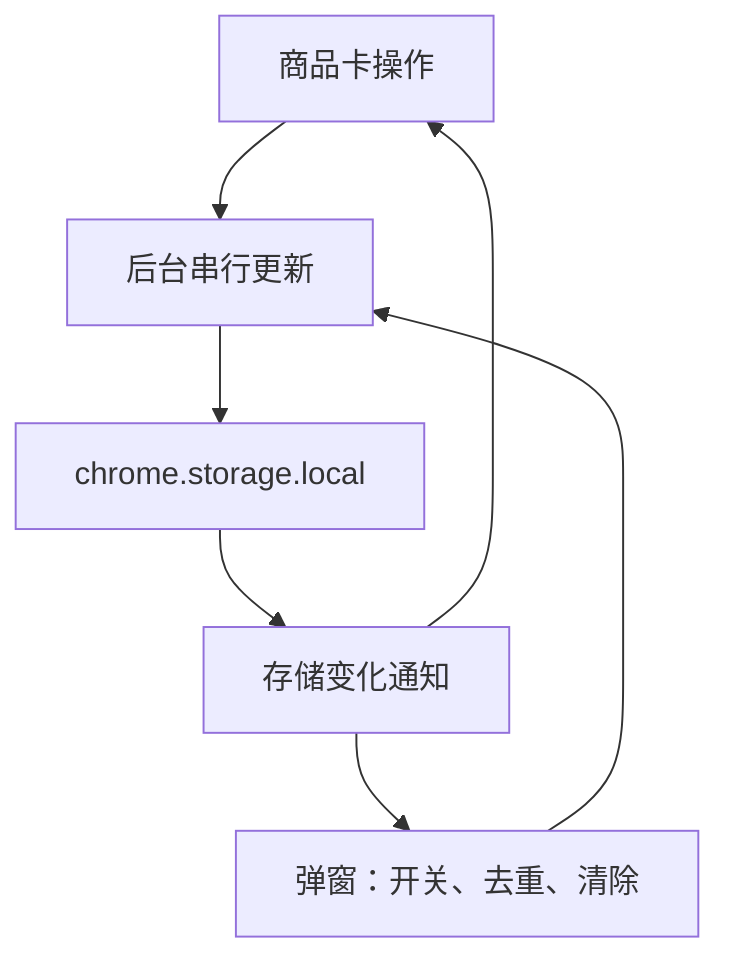

# 亚马逊 ASIN 收集器与图片下载插件：项目总结

> 对应版本：v1.2.0。本文说明当前实现、这次问题的原因、修复方式及真实验证范围。

## 1. 项目目标与最终交互

这是一个无需构建、无需登录的 Chrome Manifest V3 扩展，包含两个独立功能。

| 功能 | 使用位置 | 当前交互 |
| --- | --- | --- |
| ASIN 收集 | 搜索、BS/NS 榜单、详情主商品、可识别的推荐卡片 | 「收集／取消收集」与「已收集 (总数)」 |
| 列表管理 | 浏览器工具栏的插件弹窗 | 只读逐行列表、一键复制、一键去重、一键清除 |
| 图片下载 | 商品详情页右侧 | 「下载主图＋A+」「切换手机端刷新下载A+」 |

两个开关互不影响。各商城共用同一份 ASIN 列表，相同 ASIN 只保留一次。

**商品卡的「已收集」按钮继续保留，用来显示全局数量；点击不出现网页 ASIN 小面板。** 图片下载进度提示仍保留，二者不是同一个面板。

## 2. 这次解决的问题

### 2.1 缺少批量清除

以前只能在对应商品卡上取消单个 ASIN。v1.2.0 在插件弹窗增加「一键清除」，直接把当前扩展的 ASIN 数组写为空数组，保留两个功能开关。

清除后会同步更新其他标签页的收集按钮、已收集数量和工具栏徽章。没有额外确认步骤，也没有撤销功能；需要备份时可先一键复制。

### 2.2 “No downloadable Amazon detail images found”

旧逻辑对页面布局和图片目录限制较多，且点击时只扫描一次。可能出现：

- 当前页面使用移动端或其他主图容器，不在旧选择器中。
- 图库信息在页面内嵌数据中，但还未完整渲染成图片节点。
- A+ 使用 I/G 图片目录，被旧版仅接受 S 类指定目录的条件排除。
- 内容尚未加载，或者该商品本身没有 A+。

新版扩大已知主图和 A+ 容器范围，读取当前商品的结构化图库，支持 A+ 区域中的 I/S/G 图片，并在下载前短时等待和重复扫描。

这不是把整个网页所有图片都下载下来：推荐商品、对比表、品牌故事等仍尽量排除，避免混入无关图片。

### 2.3 主图漏取与缩略图混入

本次取得了用户提供商品 `B0CMHT536M` 的实际桌面 HTML。

旧版扫描结果虽然也是 7 个主图候选，但其中一个来自展示主图，另外六个来自缩略图。页面的 `ImageBlockATF / colorImages.initial` 中存在完整高清图库，而且缩略图和高清图可能使用不同图片 ID。

例如当前抓取内容中，一组对应关系为：

```text
缩略图：31c66lmKg8L._AC_US100_.jpg
高清图：61lmLycT9iL._AC_SL1500_.jpg
```

因此，仅去掉尺寸参数或按图片 ID 去重，并不能可靠地把缩略图变成高清图。

新版解析图库记录，将每条记录的 `thumb`、`large`、`hiRes`、`main` 视为同一张图的不同候选，优先使用明确高清地址，并抑制相应缩略图别名。当前商品的真实高清图由此能够进入下载队列。

### 2.4 手机端按钮原先只有名称上的误解

v1.1.0 的第二个按钮只刷新原网页并下载 A+，没有设置手机请求头。

v1.2.0 按用户指定名称改为「切换手机端刷新下载A+」，并增加真正的移动请求流程：临时为当前标签页、当前商城设置手机请求头，跳转 `/gp/aw/d/ASIN?psc=1`，新页面启动后自动执行 A+ 下载。

这是手机请求头加移动商品地址，不是完整的 DevTools 手机设备仿真：不会修改屏幕大小、JavaScript navigator 属性或触摸能力。最终是否返回移动布局，由亚马逊决定。

## 3. 文件架构

| 文件 | 职责 |
| --- | --- |
| `manifest.json` | Manifest V3、商城范围、脚本入口和权限 |
| `common.js` | ASIN 规范化、去重、域名检查与商品 URL 解析 |
| `background.js` | 统一状态读写、串行操作队列、工具栏计数 |
| `content.js` | 商品卡发现、收集按钮与实时总数、动态页面监听 |
| `popup.html / popup.css / popup.js` | 两个开关、列表、复制／去重／清除 |
| `image-downloader.js` | 图库解析、图片筛选、等待扫描、下载任务和 ZIP |
| `image-fetch.js` | 图片 CDN 后台请求与二进制传输 |
| `mobile-mode.js` | 当前标签页的临时移动请求规则和清理 |
| `icons/` | 插件图标 |
| `使用说明.md / 验证记录.md / 项目总结.md` | 安装更新、验证证据与实现说明 |

页面脚本操作 DOM，弹窗负责配置和列表管理；共享状态与带权限的网络操作由扩展后台负责。



## 4. ASIN 识别原理

### 4.1 先确定单商品容器

优先识别：

- 搜索：`s-search-result`、`s-result-item[data-asin]`。
- 榜单：`zg-grid-general-faceout`、`zg-item-immersion`、`gridItemRoot`。
- 轮播：`li.a-carousel-card` 及部分 p13n 商品容器。

已选中外层商品卡时，避免在同一商品的内部节点重复添加按钮。

### 4.2 从属性提取 ASIN

支持 `data-asin`、`data-csa-c-asin`、`data-p13n-asin`、`data-csa-c-item-id` 和 `data-p13n-asin-metadata`。

ASIN 去空格、转大写，按十位字母数字校验。此处校验格式，不联网验证 ASIN 是否真实存在，也不限制必须以 B0 开头。

### 4.3 从商品链接补充

解析 `/dp/`、`/gp/product/`、`/gp/aw/d/` 路径，以及部分编码广告跳转参数。

通用兜底仅选取带图片、商品链接指向同一 ASIN 的小容器，避免把包含多个不同商品的大模块作为一张商品卡。

详情主商品通过标题区域定位，优先使用 ASIN 输入值，其次读取当前商品 URL。

### 4.4 动态商品与样式隔离

`MutationObserver` 监听 DOM 新增、移除和相关属性变化，约 160ms 合并调度；可见页面每 2.5 秒补查一次，捕捉仅更新 input.value 的变体变化。

Map 记录商品容器与已注入控件，节点或 ASIN 变化时清理旧控件。收集控件使用 Shadow DOM，降低宿主页面样式干扰。

## 5. 状态、持久化与一键清除

存储键仍为 `asinCollectorState`，示例：

```json
{
  "enabled": true,
  "imagesEnabled": true,
  "asins": ["B0CMHT536M"],
  "revision": 18
}
```

| 字段 | 含义 |
| --- | --- |
| enabled | ASIN 收集开关 |
| imagesEnabled | 图片下载开关 |
| asins | 按首次收集顺序排列的去重列表 |
| revision | 状态修订序号 |

所有状态操作经后台 Promise 队列串行执行，每次读取最新列表再写回，避免两个标签页同时收集时互相覆盖。

收集消息使用明确的 `selected: true/false`，重复收集不会造成重复记录。清除使用新增的 `CLEAR_ASINS`，仅修改 asins 并递增 revision。

页面与弹窗通过 `chrome.storage.onChanged` 同步，忽略比当前 revision 更旧的响应。保存失败时显示错误，不把失败操作显示为成功。

数据在当前 Chrome 用户配置中的扩展 storage 保存，不依赖亚马逊账号。不自动跨电脑同步；卸载插件可能删除数据。更新继续使用原存储键，不主动清空旧记录。

## 6. 新版图片识别与防漏逻辑

### 6.1 DOM 主图范围

除了原有的 landingImage、缩略图与主图轮播，还补充 `#image-block`、`#main-image`、`#imageBlock_feature_div` 等范围，读取 src、currentSrc、动态图片属性和懒加载属性。

仍过滤视频、色块和明确无关内容，不把推荐商品图库合并为当前商品主图。

### 6.2 安全读取页面图库数据

扫描包含 `colorImages` 或 `imageGalleryData` 的内嵌脚本文本，解析：

- `initial` 数组。
- `A.$.parseJSON('...')` 包裹的 JSON 字符串。
- JSON 形式的颜色图库，结合当前主图 ID 选择对应组。

仅自行解析字符串和 JSON，**不执行网页脚本，不使用 eval**。

带明确 asin 的脚本需与当前商品一致；同时结合当前主图 ID 检查匹配，减少混入其他颜色变体的风险。不是盲目抓取脚本中的所有图片 URL。

### 6.3 高清优先与别名去重

每条图库记录依次考虑 hiRes、main 中较大的候选、large、lowRes。图库顺序优先保留。

同一记录中的 thumb、large、hiRes 等 ID 记为别名，DOM 中对应的缩略图不再作为额外商品图片加入。

下载时先请求已经明确取得的展示／高清地址；失败后再尝试原有尺寸替换和原图地址。避免优先构造一个未验证的地址，而忽略页面已经给出的高清 URL。

### 6.4 A+ 放宽目录、保持区域约束

在 `#aplus_feature_div`、`#aplus`、`#aplus3p_feature_div`、`#aplus-mweb_feature_div` 和部分 A+ 正文容器中提取图片。

允许 I/S/G 类图片，不再要求全部来自 `aplus-media-library-service-media`。支持常见懒加载属性与 noscript 图片链接。

仍按可识别结构排除品牌故事和对比表。S/G 图片的去重键现在包含目录，降低不同目录同名图片被误去重的风险。

### 6.5 下载前等待与滚动加载

点击下载后立即显示扫描状态并禁用下载按钮，最多执行 16 次、每次间隔 500ms 的扫描，约 8 秒。

发现 A+ 容器时滚动到该位置，促使懒加载启动；若用户没有自行滚动、触摸或按键，扫描结束后恢复原位置。没有自动遍历整页或逐个切换所有轮播。

当所需类别都已经有图片且连续扫描稳定时提前结束。扫描期间如果当前 ASIN 改变，则提示重新下载，避免混合两个变体。

若主图或 A+ 仍为零，会明确显示缺失类别。零候选不再只显示一句英文错误；部分成功也不会隐瞒缺少主图或 A+ 的情况。

## 7. 图片下载与 ZIP

### 7.1 后台图片请求

油猴的 `GM_xmlhttpRequest` 已由 `image-fetch.js` 替代。只允许亚马逊图片 CDN 的图片路径，统一 HTTPS，不携带登录凭据，拒绝重定向与明确非图片响应。

单次请求超时由旧版 7 秒提高为 **20 秒**。对超时、网络错误或 HTTP 5xx，当前候选重试一次；404 等错误直接尝试后备地址。每个页面下载任务最多三个并发，不是跨标签页全局限制。

### 7.2 二进制通信

后台把图片 ArrayBuffer 转成 Base64，经扩展消息返回，页面再恢复二进制。这会增加临时内存占用，目前未做流式或分片传输。

图片请求走独立处理器，不占用 ASIN 状态写入队列。

### 7.3 下载结果结构

| 文件 | 内容 |
| --- | --- |
| main_01.* 等 | 主图，按识别顺序编号 |
| aplus_01.* 等 | A+ 图片 |
| queue.json | 候选队列、来源与尝试地址 |
| manifest.json | 每张图成功／失败、实际 URL、字节数与错误 |
| diagnostics.json | 当前 ASIN、页面 URL、两类数量及缺失标记 |

下载包内 manifest.json 是结果清单，与扩展自己的 manifest.json 配置文件不同。

沿用原脚本的 CRC32 和 ZIP STORE 封装：优先 Worker，失败则页面内打包，不依赖远程库。并发完成顺序可能影响 ZIP 内部条目顺序，但不改变文件编号。

单张失败不取消其他图片。全部请求失败时也会保留清单；完全没有识别到候选时不生成空图片 ZIP，而是在页面提示。

## 8. 手机端刷新下载 A+

### 8.1 执行顺序

1. 验证当前商品 ASIN 和图片开关。
2. 在当前页面 sessionStorage 写入一次性自动下载标记。
3. 向后台发送 `START_MOBILE_MODE`。
4. 后台建立当前 tabId、当前商城域名限定的 session rule。
5. 请求头设置移动 User-Agent、移动 Client Hint 和 Android 平台标记。
6. 跳转同商城 `/gp/aw/d/ASIN?psc=1`。
7. 页面重新加载后消费标记，等待 2.5 秒，再执行 A+ 等待扫描与下载。

### 8.2 临时规则的范围与恢复

规则只作用于该标签页、该商城的文档与 XHR 请求，不修改其他标签页或全局浏览器配置。

完成任务、关闭图片开关、关闭标签页时会清理；另有三分钟到期清理，防止导航失败遗留规则。

清理恢复的是后续请求头，**不会自动把已经显示的手机布局重新渲染成桌面页**。需要桌面布局时可重新打开普通 `/dp/ASIN` 商品链接。

新增 `declarativeNetRequestWithHostAccess`、商城 host_permissions 和 alarms 权限分别用于请求头修改、指定商城访问和超时清理。

依据：[Chrome declarativeNetRequest 官方文档](https://developer.chrome.com/docs/extensions/reference/api/declarativeNetRequest)。

## 9. 本次真实样本与测试结果

目标：用户提供的 Fanpat 商品 `B0CMHT536M`。

| 验证方式 | 结果 |
| --- | --- |
| 桌面商品页面 HTTP 请求 | 200，取得实际 HTML，标题与 ASIN 对应 |
| 原版处理该 HTML | 7 个主图候选，其中 6 个来自缩略图；8 张 A+ |
| 新版处理同一 HTML | 7 张明确高清主图；8 张 A+ |
| 对上述 15 个 URL 实际发起图片请求 | 15 张均成功 |
| 图片文件解码 | 15 张均通过；7 张主图长边为 1500px |
| 使用实际图片字节运行打包流程 | 输出 15 张图片和 3 个 JSON 清单 |
| ZIP CRC 与逐文件字节核对 | 通过 |
| 带移动请求头访问手机商品地址 | 200，取得实际 HTML |
| 新版读取本次手机 HTML | 7 张主图、3 张 A+；初始手机内容与桌面内容不同 |

本次手机 HTML 的 A+ 数量更少，说明手机端不保证比桌面端包含更多图片。实际浏览器后续懒加载也可能改变数量，不能把初始 HTML 数量当成所有用户会看到的固定结果。

模拟接口回归另外覆盖：两个开关独立、旧数据兼容、清除归零、跨页计数、并发写入、动态卡片、移动规则范围与清理、超时重试、后备下载、旧 I/G A+、移动主图容器和延迟插入图片。

**验证限制：**浏览器直接打开目标 URL 返回 `ERR_BLOCKED_BY_CLIENT`；没有完成在该浏览器中安装本插件后逐按钮的端到端实测。移动规则通过模拟 Chrome API 验证，移动页面 HTTP 请求另行验证，不能声称真实 Chrome 的规则生效、重定向、自动下载全链路都已验证。

## 10. 已知边界与后续维护

- 多层选择器不是任意亚马逊布局的万能识别器。A/B 页面或新图库格式仍可能需要补充。
- 只选择当前商品／匹配图库，不批量下载所有颜色的变体图。
- 最多约 8 秒等待和一次 A+ 定位滚动，不保证所有懒加载或轮播图片全部进入 DOM。
- 移动请求不是完整设备仿真，网页可能按其他条件返回桌面或不同内容。
- 图片任务依赖当前页面，关闭页面会丢失正在打包的任务；不支持断点续传。
- 关闭功能后已发出的图片请求可能继续至完成或超时，后续任务检查会停止输出。
- 图片后台仍拒绝重定向；如实际遇到必须跳转的 CDN，应单独验证后增加受限支持。
- 图片体积大时 Base64 和 ZIP 会占用更多内存，暂未加入全局任务管理或流式打包。
- 只支持当前列出的 24 个亚马逊 HTTPS 商城域名；未来新增需更新配置。

维护时优先提供：页面 URL、当前 ASIN、缺少的类别、相应商品／图片区块 outerHTML，以及下载包内三个诊断 JSON。修改选择器后应补充对应页面样例测试，避免修复一个布局时混入其他变体或推荐图片。

## 11. 更新与交付

从旧版升级：把新版文件覆盖到原插件文件夹，在 `chrome://extensions` 重新加载原插件，按 Chrome 提示确认新增权限，再刷新亚马逊页面。不要卸载原插件，以保留已有 ASIN。

当前交付为 `amazon-asin-collector-v1.2.0.zip`，本《项目总结.md》已放在其中。ZIP 仅包含插件及说明，不包含测试抓取的第三方商品页面或图片。
