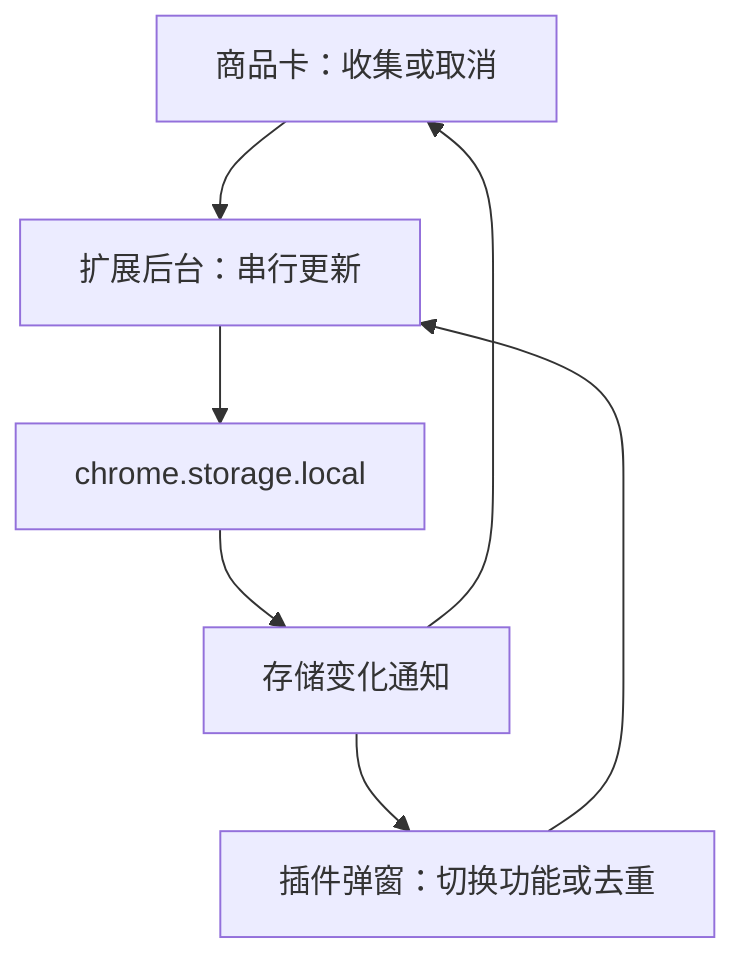

# 亚马逊 ASIN 收集器与图片下载插件：项目总结

> 对应版本：v1.1.0  
> 项目类型：Chrome Manifest V3 扩展  
> 本文依据当前实际代码整理，区分已经实现的功能、具体实现原理和尚未验证的范围。

## 1. 项目目标与最终需求

这个插件把两件日常运营工作放在同一个 Chrome 扩展中：浏览亚马逊时收集商品 ASIN，以及下载商品详情页的主图与 A+ 图片。

### 1.1 ASIN 收集

- 在搜索结果、BS 榜单、NS 榜单、商品详情页主商品及可识别的推荐商品卡上，添加收集控件。
- 点击「收集」保存 ASIN，按钮变成「取消收集」；再次点击则移除。
- 同一 ASIN 的多个卡片共享收集状态，不因为重复出现而增加记录。
- 各商城共用一个列表，只按 ASIN 去重，不按国家拆分。
- 跨网页、跨标签页继续使用同一个列表，关闭浏览器后数据仍按扩展本地存储机制保留。
- 商品卡保留「已收集 (数量)」按钮，实时显示全局列表总数。
- **「已收集」仅用于查看数量，点击不打开网页小面板。** 完整列表在浏览器工具栏的插件弹窗中查看。
- 弹窗列表只读，每行一个 ASIN，支持手动复制、一键复制和一键去重。

### 1.2 图片下载

图片功能以用户上传的油猴脚本 `Amazon Detail Image Downloader 2026-08-11.2` 为基础迁移，保留其核心图片识别和下载规则。

开启后，在商品详情页右侧显示两个操作：

| 操作 | 行为 | 输出文件 |
| --- | --- | --- |
| 下载主图＋A+ | 提取当前主图图库与 A+ 正文图片并打包 | `ASIN_amazon_detail_images.zip` |
| 刷新后仅下载 A+ | 标记任务、刷新页面，等待 2.5 秒后只提取 A+ | `ASIN_amazon_aplus_only.zip` |

### 1.3 两个开关独立运行

| ASIN 收集 | 图片下载 | 页面行为 |
| --- | --- | --- |
| 关闭 | 关闭 | 不显示两项功能的页面控件 |
| 开启 | 关闭 | 商品卡显示收集与计数按钮 |
| 关闭 | 开启 | 详情页显示图片下载按钮 |
| 开启 | 开启 | 两项功能同时运行 |

关闭某项功能会移除该功能的页面控件；关闭 ASIN 收集不会清空已保存的数据。

## 2. 版本演进与需求取舍

| 版本或调整 | 实现内容 |
| --- | --- |
| v1.0.0 | 完成跨商城 ASIN 收集、持久保存、商品卡收集与计数、弹窗列表、网页左下角列表面板 |
| v1.1.0 | 增加图片下载独立开关，把油猴主图／A+ 下载逻辑迁入扩展 |
| 最终交互修正 | 保留商品卡「已收集 (数量)」，只移除网页 ASIN 小面板，列表统一在插件弹窗中查看 |

这里移除的是 **ASIN 列表面板**。图片下载原有的进度提示仍然保留，用于显示下载和打包状态。

没有新增 ASIN 手动编辑、按商城分组、ASIN 导入、批量自动收集整页商品、跨电脑同步等功能。

## 3. 整体架构与文件分工

插件不需要额外服务器，也没有构建步骤。页面识别、消息通信、持久保存、图片请求与 ZIP 生成均由扩展及浏览器完成。

| 文件 | 主要职责 |
| --- | --- |
| `manifest.json` | 声明 Manifest V3、版本、权限、商城匹配规则、后台入口与内容脚本 |
| `common.js` | ASIN 校验与去重、亚马逊域名检查、商品链接 ASIN 解析 |
| `background.js` | 统一读取和写入状态、串行处理更新消息、更新插件图标计数 |
| `content.js` | 识别商品卡、注入收集与计数按钮、监听动态页面和存储变化 |
| `popup.html` | 两个功能开关、ASIN 文本框及操作按钮 |
| `popup.css` | 插件弹窗样式 |
| `popup.js` | 弹窗读取状态、保存开关、复制与去重操作 |
| `image-downloader.js` | 商品图片提取、筛选、候选排序、下载队列、ZIP 生成和下载控件 |
| `image-fetch.js` | 在扩展后台请求亚马逊图片，替代油猴专用的网络接口 |
| `icons/` | Chrome 工具栏及扩展管理页图标 |
| `使用说明.md` | 安装、更新、功能操作和使用范围 |
| `验证记录.md` | 已执行的验证及其限制 |

### 3.1 为什么分成页面脚本、弹窗和后台

页面脚本负责接触网页 DOM：发现商品、添加按钮、读取图片元素。弹窗负责用户配置和查看收集结果。后台负责共享状态与有权限的图片请求。

不同网页的页面脚本各自独立运行，但它们都向同一个扩展后台发送消息，因此可以共享同一份收集结果。



## 4. 商城覆盖方式

代码没有使用 `https://www.amazon.**/*` 作为配置值，而是在 `manifest.json` 中逐项声明域名匹配模式，例如：

```json
"https://*.amazon.com/*"
"https://*.amazon.de/*"
"https://*.amazon.co.jp/*"
```

当前共配置 24 个域名：

| 区域 | 域名 |
| --- | --- |
| 美洲 | `amazon.com`、`amazon.ca`、`amazon.com.mx`、`amazon.com.br` |
| 欧洲 | `amazon.co.uk`、`amazon.de`、`amazon.fr`、`amazon.it`、`amazon.es`、`amazon.nl`、`amazon.com.be`、`amazon.ie`、`amazon.pl`、`amazon.se` |
| 亚洲及大洋洲 | `amazon.co.jp`、`amazon.in`、`amazon.com.au`、`amazon.sg`、`amazon.cn` |
| 中东及非洲 | `amazon.ae`、`amazon.sa`、`amazon.com.tr`、`amazon.eg`、`amazon.co.za` |

这张表描述的是插件中的配置，不代表每个域名都已逐一完成页面实测。

内容脚本在 `document_idle` 阶段加载，并再次使用 `common.js` 的域名检查。以后新增商城，需要同时更新 `manifest.json` 和 `common.js`，当前不是自动识别未来所有新后缀。

## 5. ASIN 商品识别原理

### 5.1 核心思路：先找商品容器，再确定 ASIN

不能把网页中所有带有 ASIN 的元素都直接加按钮。一个商品卡可能在外层、图片区域和子节点中重复出现同一个 ASIN；一个推荐模块又可能包含多个不同商品。

当前实现采用多层识别，优先使用明确的商品容器，再做属性识别和链接补充，尽量避免重复添加控件或把整个推荐模块误当成单件商品。

### 5.2 第一层：常见商品卡结构

| 页面模块 | 主要选择器 |
| --- | --- |
| 搜索结果 | `[data-component-type="s-search-result"]`、`.s-result-item[data-asin]` |
| BS／NS 榜单 | `.zg-grid-general-faceout`、`.zg-item-immersion`、`[id="gridItemRoot"]` |
| 推荐轮播 | `li.a-carousel-card` |
| p13n 推荐商品 | `.p13n-sc-uncoverable-faceout`、`.p13n-sc-completable-faceout` |

找到这些容器后，优先读取容器本身的 ASIN 信息。已经选中的外层商品卡，其内部节点通常不再重复添加控件。

### 5.3 第二层：商品属性

读取的属性包括：

- `data-asin`
- `data-csa-c-asin`
- `data-p13n-asin`
- `data-csa-c-item-id`
- `data-p13n-asin-metadata`

其中 `data-csa-c-item-id` 可以从末尾提取 ASIN，例如 `amzn1.asin.1.B012345678`；元数据属性则按 JSON 解析 `asin` 或 `ASIN` 字段。

通用属性识别还会检查容器是否有商品图片或商品链接，并尽量排除同时含有多个不同商品链接的宽泛模块。

### 5.4 第三层：从商品链接补充识别

主要解析：

```text
/dp/ASIN
/gp/product/ASIN
/gp/aw/d/ASIN
```

对于常见广告跳转，还会尝试从 `url`、`redirectUrl`、`redirect`、`u` 参数中解析商品目标地址，并处理部分 URL 编码。

候选链接仍需指向已配置的亚马逊域名。普通外部网站即使包含 `/dp/XXXXXXXXXX` 形式，也不会因此被识别成亚马逊商品。

链接兜底会从链接向上查找最多五层小容器，要求有图片且可解析的商品链接对应同一 ASIN。它是补充规则，不是对任意网页结构的保证。

### 5.5 ASIN 格式校验

统一转换为大写、去除两端空格，再检查是否满足：

```javascript
/^[A-Z0-9]{10}$/
```

这是格式校验，不会联网验证 ASIN 是否真实存在。也不会只接受 `B0` 开头，以免排除其他合法格式的商品标识。

### 5.6 详情页主商品

通过 `#productTitle` 或 `#title_feature_div h1` 定位标题区域，在其所属标题容器前部添加控件。

ASIN 获取优先顺序为：

1. `#ASIN` 输入值。
2. 表单内 `input[name="ASIN"]` 的值。
3. 当前商品 URL。

此优先级用于 ASIN 收集功能。图片下载的命名函数保留了油猴原规则：**优先从 URL 获取 ASIN，再读 DOM**，两处实现目前并不相同。

## 6. 商品卡控件与动态页面

### 6.1 按钮如何加入页面

每个商品容器前部插入一个 `asin-collector-ui` 自定义元素，通过 Shadow DOM 放入按钮和样式。

Shadow DOM 用于降低亚马逊页面样式对收集控件的影响。按钮事件会阻止默认行为与冒泡，减少点击收集时意外进入商品详情或触发卡片操作的情况。

每个商品卡显示：

| 元素 | 行为 |
| --- | --- |
| 收集／取消收集 | 改变当前 ASIN 在全局列表中的状态 |
| 已收集 (数量) | 显示去重后的全局总数；点击无弹出动作，悬停提示从工具栏查看完整列表 |
| 错误提示 | 保存失败时说明原因，不伪装成已保存 |

### 6.2 避免重复按钮与连续点击

`mounted` 使用 Map 记录「商品 DOM 容器 → 控件及 ASIN」。扫描后复用仍然有效的控件；容器被移除、控件消失或 ASIN 改变时，移除旧控件并按新结果处理。

`pending` 使用 Set 记录正在提交的 ASIN。在同一页面内，一个 ASIN 正在保存时，对应卡片按钮会暂时禁用，避免连续点击发出重复操作。

### 6.3 动态页面监听

使用 `MutationObserver` 监听新增／删除元素和 ASIN、链接、输入值等属性变化。相关变化通过约 160 毫秒的调度合并后再扫描，并忽略插件自身产生的部分变化，避免反复触发自己。

页面可见时，每 2.5 秒安排一次补充扫描，用于处理某些变体只修改 `input.value`、不修改 HTML 属性的情况。

当前策略是重新发现页面候选商品，并复用已有控件，不是只分析变化节点的完整增量扫描。超长页面仍有性能优化空间。

## 7. 存储、去重与跨标签页同步

### 7.1 保存结构

使用 `chrome.storage.local`，统一存储键为 `asinCollectorState`。示例：

```json
{
  "enabled": true,
  "imagesEnabled": false,
  "asins": ["B012345678", "B087654321"],
  "revision": 15
}
```

| 字段 | 说明 |
| --- | --- |
| `enabled` | ASIN 收集开关 |
| `imagesEnabled` | 图片下载开关 |
| `asins` | 按收集顺序保存的 ASIN 数组 |
| `revision` | 状态修订序号，用于避免旧消息覆盖较新界面状态 |

未设置的开关按关闭处理。v1.0.0 数据缺少 `imagesEnabled` 时，仅补充默认值，不清空旧列表。

### 7.2 为什么后台统一写入

如果两个网页各自执行「读旧数组 → 加入 ASIN → 写回」，可能出现后一次写入覆盖前一次新增的问题。

当前将所有状态操作发送给 `background.js`，使用 Promise 队列依次执行。每次操作都重新读取最新存储，再修改并写回。

这保证当前扩展实例的统一写入路径按顺序处理，不是跨设备事务，也不防止其他代码绕过后台直接改写同一存储键。

### 7.3 不发送盲目翻转，而是发送目标状态

收集消息示例：

```json
{
  "type": "SET_COLLECTED",
  "asin": "B012345678",
  "selected": true
}
```

`selected: true` 表示确保收集，`false` 表示确保移除。重复发送相同目标不会产生重复 ASIN；不同标签页提交冲突操作时，按后台处理顺序得到最终状态。

### 7.4 去重逻辑

读取时先规范化数组并通过 Set 去重，收集时也检查是否已经存在。弹窗的「一键去重」会再次保存规范化结果。

保留首次出现顺序，不自动排序。取消后重新收集，会排在列表末尾。一个 ASIN 在多个商城出现，也只占一条记录。

### 7.5 同步机制

页面脚本和弹窗监听 `chrome.storage.onChanged`。后台写入成功后，各页面更新按钮、全局计数和弹窗文本框。

每次写入增加 `revision`，接收端忽略修订序号更小的状态，避免延迟到达的旧响应把界面退回旧状态。

插件工具栏徽章也显示已收集数量；徽章颜色当前依据 ASIN 收集开关，不用于表示图片功能开关。

### 7.6 持久化范围

ASIN、开关保存到当前 Chrome 配置中的扩展本地存储，不依赖当前网页和亚马逊账号。后台进程重新运行时会重新从存储读取，不依赖内存中的数组长期存在。

未实现云同步。卸载扩展可能删除扩展数据；使用不同 Chrome 配置或另装一份扩展，也不等于继续使用原来的数据。

## 8. 图片提取与下载原理

### 8.1 主图提取

沿用原油猴的范围：主图元素、主图缩略图和主图轮播，如 `#landingImage`、`#imgBlkFront`、`#altImages`、`#main-image-container` 等。

对元素读取 `currentSrc`、`src`、`srcset`，以及名称包含图片、来源、样式或数据线索的属性，提取其中的亚马逊图片 URL。

主图要求图片属于 `/images/I/`，并排除视频缩略图、播放按钮及其他符合原脚本排除规则的图片。不会把整页所有商品图片都作为主图下载。

### 8.2 A+ 提取

主要扫描 `#aplus_feature_div` 及其 `.aplus-v2` 内容，读取图片、source、背景样式和常见懒加载属性。

沿用原条件：只保留 `/images/S/` 且路径包含 `/aplus-media-library-service-media/` 的内容图；默认排除品牌故事和对比表。

因此，采用其他目录或结构的 A+ 图片可能不会被识别。这是保留原脚本筛选逻辑产生的边界。

### 8.3 URL 清理、图片 ID 与候选排序

处理 HTML 实体、转义斜杠、协议相对路径和查询参数，拆出：

| 字段 | 用途 |
| --- | --- |
| `image_id` | 图片去重标识 |
| `source_url` | 去掉 `._...` 图片变换参数后的候选原图地址 |
| `display_url` | 页面实际引用的展示地址 |
| `transform` | 尺寸等变换参数 |
| `bucket` | I、S 等图片目录类别 |
| `source` | 从哪个节点或属性发现图片 |

同一图片可能同时以缩略图、展示图和高清地址出现。程序按 `image_id` 去重，并采用原脚本评分选择候选：无变换参数、高清属性来源、部分尺寸参数等会影响评分。

这属于 URL 与属性启发式判断，不会先下载所有版本再比较真实分辨率。原脚本对 S 类图片 ID 也没有包含完整目录，极少数不同目录同名图可能被视作同一图片。

### 8.4 1600 尺寸与后备顺序

主图按以下顺序尝试，重复 URL 会先去掉：

1. 展示地址经原 `_AC_SX`／`_AC_SY` 替换规则处理后的地址。
2. 原图地址经同样替换后的地址。
3. 原图地址。
4. 展示地址。

A+ 则先尝试展示地址，再尝试原图地址。

这里的「1600」是对符合特定格式的 URL 做替换，不会强制所有图片生成 1600 像素版本，也不是图片放大算法。

### 8.5 油猴请求迁移到扩展后台

原脚本使用 `GM_xmlhttpRequest`。扩展中由页面脚本发送 `FETCH_AMAZON_IMAGE`，交给 `image-fetch.js` 使用 fetch 请求图片。

后台会检查图片功能是否开启、请求主机和图片路径，声明的图片权限为：

```text
https://m.media-amazon.com/*
https://*.ssl-images-amazon.com/*
```

请求统一使用 HTTPS，不携带登录凭据；7 秒超时，通过 AbortController 中止。当前实现拒绝 HTTP 重定向，因此与油猴的网络层并非完全等同。如果某个 CDN 地址必须先重定向，可能需要以后补充受限的重定向处理。

响应会排除明确的文本、JSON、XML 类型和空内容，但没有做完整图片解码验证。

### 8.6 二进制如何跨脚本传递

后台取得 ArrayBuffer 后编码为 Base64 字符串，页面脚本收到后再恢复成 Uint8Array／ArrayBuffer，交给 ZIP 打包。

这样避免直接通过当前采用的 JSON 消息接口传递 ArrayBuffer。代价是 Base64 体积增加，解码时还会有临时内存开销；当前没有针对超大图片实现分片传输或流式 ZIP。

图片请求使用独立消息处理器，不进入 ASIN 状态写入队列，因此下载图片不会占住收集操作的串行队列。

### 8.7 并发与失败处理

每次下载任务最多三个图片并发处理。同一张图片的候选 URL 按顺序尝试，失败后切换下一个，并非无限重试同一个 URL。

单张图片全部失败后记录失败信息，继续处理其他图片。即使所有图片失败，仍可输出包含诊断清单的 ZIP。

三个并发是**单个页面下载任务**的限制；多个标签页同时下载时没有全局三并发限制。

### 8.8 ZIP 结构与生成方式

输出内容包括：

| 文件 | 内容 |
| --- | --- |
| `main_01.jpg` 等 | 主图，实际扩展名由响应类型等信息判断 |
| `aplus_01.jpg` 等 | A+ 图 |
| `queue.json` | 图片队列、顺序、来源及候选下载 URL |
| `manifest.json` | 实际成功／失败、下载 URL、字节数或错误信息 |

这里 ZIP 内的 `manifest.json` 是图片下载结果清单，与 Chrome 扩展的同名配置文件无关。

沿用原脚本自行写入 ZIP 本地文件头、中央目录、结束记录和 CRC32 的实现，采用 STORE 方式封装，没有再次压缩图片。图片本身通常已经压缩，ZIP 在这里主要用于合并下载。

优先尝试 Worker 打包，Worker 创建或运行失败则降级为页面内打包。图片按队列命名，但并发完成顺序可能改变 ZIP 内部条目的排列顺序，不改变编号含义。

最后生成 Blob，通过带 `download` 属性的链接触发下载，再回收临时对象 URL。当前没有使用 `chrome.downloads` 进行下载管理。

### 8.9 刷新后只下载 A+

点击第二个操作后，将 `ac-amazon-image-downloader-auto-aplus-only` 标记写到页面 sessionStorage，再刷新。

新页面脚本启动、图片功能开启时读取并删除标记，然后等待 2.5 秒执行 A+ 下载。先删除标记可避免后续刷新反复触发同一个任务。

sessionStorage 在这里仅用于刷新后的临时任务衔接；ASIN 与功能开关仍保存在扩展 storage。它不会自动滚动整页，也不会等待所有懒加载图片全部完成。

### 8.10 下载期间关闭功能

关闭图片开关时，移除图片控件、停止观察与待执行的自动下载计时器，并改变生命周期标记。

任务在后续检查发现关闭或生命周期变化时，不再输出 ZIP。已经发往后台的单次请求可能继续到结束或超时，当前并未实现点击关闭就立即取消全部在途网络请求。

## 9. 验证结果与证据边界

本地测试使用 JSDOM、模拟 Chrome 消息／存储接口和模拟图片 CDN，运行实际插件脚本。

| 验证项目 | 结果 |
| --- | --- |
| 读取旧版数据、补充图片开关默认值 | 通过 |
| 两个独立开关的四种组合 | 通过 |
| 保留已收集实时计数、点击不出现 ASIN 面板 | 通过 |
| 原脚本与迁移代码的主图／A+ 筛选结果对比 | 通过 |
| 原脚本与迁移代码的下载 URL 顺序对比 | 通过 |
| 并发写入 ASIN 与切换图片功能 | 通过 |
| 动态新增商品卡 | 通过 |
| 图片二进制传输、模拟 404 后备与三并发 | 通过 |
| Worker 不可用时的打包降级 | 通过 |
| 主图＋A+ ZIP、A+ 专用 ZIP | 通过 |
| 刷新标记消费与 A+ 自动任务 | 通过模拟测试 |
| ZIP CRC、清单内容及逐图片字节比对 | 通过 |
| 弹窗图片开关保存、已有列表显示 | 通过 |

**未完成真实 Chrome 安装运行、实际 CDN 请求、真实浏览器重启持久化，以及全部商城实时 DOM 和视觉验收。** 原因是制作环境没有可用 Chrome，浏览器下载失败，先前给出的亚马逊页面也无法读取。

这些测试说明已覆盖的逻辑在模拟条件下符合预期，不等同于所有真实页面已完成兼容认证。

## 10. 当前限制与后续维护

| 限制或问题 | 当前情况 | 后续方向 |
| --- | --- | --- |
| Amazon 页面结构变化 | 多层规则适配，不能覆盖所有 A/B 布局 | 收集漏识别卡片 outerHTML，补充选择器与回归样例 |
| 未加载的图片 | 读取当前 DOM，固定等待不会保证加载完全 | 如有需要，再增加加载完成检测或可选滚动 |
| 变体切换与 ZIP 名称 | 图片命名保留 URL 优先规则；收集使用 DOM 优先 | 若发现错配，可统一 ASIN 解析优先级 |
| 同时多个页面下载 | 每页三个并发 | 增加后台全局任务与并发管理 |
| 大图／大量图片 | Base64 传输并在内存中打包 | 评估分片、流式或独立下载页面 |
| 页面长时间扫描 | 约 160ms 合并调度＋可见页定期扫描 | 优化为受影响容器扫描，减少整页发现成本 |
| 图片请求重定向 | 当前拒绝 | 确认实际需求后，增加严格限定 CDN 的跳转处理 |
| 浏览器关闭／页面离开 | 下载任务依赖页面，不能断点续传 | 如有需要，迁移为独立后台下载任务 |
| ASIN 数据备份 | 只能复制，没有导入恢复入口 | 可新增导出 TXT／CSV 和校验后的导入 |

这些是待选的维护方向，**不代表本次版本已经实现**。

## 11. 更新与数据保留

更新时，将新版文件覆盖到原来加载扩展的文件夹，保持路径不变，在 `chrome://extensions` 点击原插件的「重新加载」，随后刷新亚马逊页面。

不要为了更新而卸载原插件。新版本继续使用原存储键，可以读取旧 ASIN；先复制备份列表也便于恢复。

图片功能整合后，建议停用原来的同功能油猴脚本，避免同一页面同时出现两套下载按钮。

## 12. 交付状态

当前交付为 `amazon-asin-collector-v1.1.0.zip`：无需构建的 Manifest V3 插件源码、图标、安装说明和验证记录。

功能组成已经确定为：**商品卡收集与实时计数 + 弹窗统一管理 ASIN + 独立图片下载开关 + 沿用油猴规则的两种图片 ZIP 下载。**
